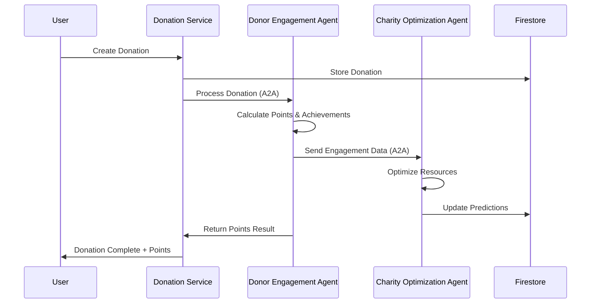

# 🎮 Google A2A Gamified Goodwill Platform - Complete Setup Guide

## 🌟 Overview

This is a production-ready, comprehensive gamified donation platform that combines cutting-edge AI agent technology with Pokemon Go-style gamification to revolutionize charitable giving. The platform leverages Google's A2A (Agent-to-Agent) protocol v0.3 for intelligent coordination between specialized AI agents.

## 🚀 Quick Start

### Prerequisites

Before you begin, ensure you have:

- **Google Cloud Project** with billing enabled
- **gcloud CLI** installed and configured
- **Docker** and **Docker Compose**
- **Python 3.11+**
- **Node.js 18+**
- **Terraform 1.0+**

### 1. Clone and Setup

```bash
# Clone the repository
git clone <repository-url>
cd goodwillC

# Copy environment configuration
cp .env.example .env

# Edit .env with your configuration
nano .env
```

### 2. Environment Configuration

Update `.env` with your values:

```bash
# Required Settings
GCP_PROJECT_ID=your-project-id
GCP_REGION=us-central1
GOOGLE_MAPS_API_KEY=your-google-maps-api-key

# Optional Settings
ENVIRONMENT=dev
API_HOST=localhost
API_PORT=8000
```

### 3. Deploy Infrastructure

```bash
# Navigate to infrastructure directory
cd infrastructure/terraform

# Copy and configure terraform variables
cp terraform.tfvars.example terraform.tfvars
nano terraform.tfvars

# Deploy infrastructure
terraform init
terraform plan
terraform apply
```

### 4. Deploy Application

```bash
# Return to root directory
cd ../..

# Run full deployment
python deployment/deploy.py --project-id=your-project-id --action=full
```

### 5. Verify Deployment

After deployment, verify all services:

```bash
# Check service health
python deployment/deploy.py --project-id=your-project-id --action=verify

# View deployment summary
gcloud run services list --project=your-project-id
```

## 🏗️ Architecture Overview

### Component Architecture

```
┌─────────────────────────────────────────────────────────────────┐
│                    Frontend Layer                                │
├─────────────────────┬───────────────────┬───────────────────────┤
│  Streamlit Dashboard │   Maps Interface  │   Mobile Web App      │
│  (App Engine)        │   (Static Hosting)│   (PWA)              │
└─────────────────────┴───────────────────┴───────────────────────┘

┌─────────────────────────────────────────────────────────────────┐
│                    API Gateway Layer                             │
├─────────────────────────────────────────────────────────────────┤
│              Google Cloud API Gateway                           │
│            (Load Balancing & Rate Limiting)                     │
└─────────────────────────────────────────────────────────────────┘

┌─────────────────────────────────────────────────────────────────┐
│                  Microservices Layer                            │
├───────────────┬───────────────┬─────────────┬─────────────────┤
│ Donation      │ Points        │ Donor       │ Charity         │
│ Service       │ Service       │ Engagement  │ Optimization    │
│ (Cloud Run)   │ (Cloud Run)   │ Agent       │ Agent           │
│               │               │ (Cloud Run) │ (Cloud Run)     │
└───────────────┴───────────────┴─────────────┴─────────────────┘

┌─────────────────────────────────────────────────────────────────┐
│                     Data Layer                                   │
├─────────────────┬─────────────────┬─────────────────────────────┤
│   Firestore     │    Pub/Sub      │      Storage Bucket        │
│   (Database)    │  (Messaging)    │    (Static Assets)         │
└─────────────────┴─────────────────┴─────────────────────────────┘
```

### A2A Agent Communication Flow



## 🎮 Key Features

### 1. Pokemon Go-Style Gamification

- **Location-Based Rewards**: Proximity bonuses for nearby donations
- **Tier Progression**: Bronze → Silver → Gold → Platinum → Diamond
- **Achievement System**: 20+ unlockable achievements
- **Real-Time Leaderboards**: Global and tier-specific rankings
- **Streak Tracking**: Daily donation streaks with multipliers

### 2. AI-Powered Optimization

- **Dual-Agent System**: DEA for engagement, COA for optimization
- **Predictive Analytics**: Prophet-based demand forecasting
- **Smart Inventory**: Automated restocking recommendations
- **Seasonal Intelligence**: Holiday and event-based bonuses

### 3. Advanced Mapping

- **Interactive Hotspots**: Pokemon Gym-style donation locations
- **Heat Map Visualization**: deck.gl powered donation density
- **Geofencing**: Automatic location-based rewards
- **AR-Style Notifications**: Immersive user experience

## 📊 API Documentation

### Core Endpoints

#### Donations API

```bash
# Create a donation
curl -X POST "https://your-api-gateway/api/v1/donations" \
  -H "Authorization: Bearer YOUR_TOKEN" \
  -H "Content-Type: application/json" \
  -d '{
    "amount": 75.50,
    "donation_type": "monetary",
    "charity_id": "550e8400-e29b-41d4-a716-446655440001",
    "location": {
      "lat": 37.7749,
      "lng": -122.4194,
      "address": "Downtown Community Center"
    },
    "message": "Keep up the great work!"
  }'
```

#### Points & Achievements API

```bash
# Get user achievements
curl -X GET "https://your-api-gateway/api/v1/users/{user_id}/achievements" \
  -H "Authorization: Bearer YOUR_TOKEN"

# Get leaderboard
curl -X GET "https://your-api-gateway/api/v1/leaderboard/global?limit=10"
```

#### A2A Agent API

```bash
# Invoke Donor Engagement Agent
curl -X POST "https://donor-agent-url/a2a/invoke" \
  -H "Authorization: Bearer A2A_TOKEN" \
  -H "A2A-Protocol-Version: 0.3.0" \
  -H "Content-Type: application/json" \
  -d '{
    "skill": "process_donation",
    "params": {
      "donation_id": "abc123",
      "user_id": "user456",
      "amount": 100.0
    }
  }'
```

### WebSocket Integration

```javascript
// Connect to real-time updates
const ws = new WebSocket('wss://your-api-gateway/ws/user123');

ws.onmessage = function(event) {
    const data = JSON.parse(event.data);
    
    switch(data.type) {
        case 'donation_created':
            showNotification(`+${data.points_awarded} points!`);
            break;
        case 'achievement_unlocked':
            showAchievement(data.achievement_name);
            break;
        case 'tier_progression':
            celebrateTierUp(data.new_tier);
            break;
    }
};
```

## 🛠️ Development Workflow

### Local Development Setup

```bash
# Install dependencies
pip install -r requirements.txt
npm install

# Start services locally
docker-compose up -d

# Run individual services
cd services/donation-service
uvicorn main:app --reload --port 8000

cd services/points-service
uvicorn main:app --reload --port 8001
```

### Testing

```bash
# Run unit tests
python -m pytest services/donation-service/tests/ -v

# Run integration tests
python -m pytest tests/integration/ -v

# Run load tests
cd deployment/load-tests
locust --headless --users=10 --spawn-rate=2 --run-time=60s
```

### Code Quality

```bash
# Format code
black services/ agents/ frontend/
flake8 services/ agents/

# Type checking
mypy services/donation-service/
mypy services/points-service/
```

## 🚀 Production Deployment

### Environment-Specific Deployments

#### Development
```bash
python deployment/deploy.py \
  --project-id=dev-project \
  --region=us-central1 \
  --action=full
```

#### Staging
```bash
# Update cloudbuild.yaml substitutions
gcloud builds submit --config=cloudbuild.yaml \
  --substitutions=_ENVIRONMENT=staging,_REGION=us-central1
```

#### Production
```bash
# Production deployment with additional safeguards
gcloud builds submit --config=cloudbuild-prod.yaml \
  --substitutions=_ENVIRONMENT=prod,_REGION=us-central1
```

### Blue-Green Deployment

```bash
# Deploy to new version
gcloud run deploy donation-service \
  --image=gcr.io/project/donation-service:v2.0.0 \
  --revision-suffix=v2 \
  --no-traffic

# Gradually shift traffic
gcloud run services update-traffic donation-service \
  --to-revisions=donation-service-v2=50

# Complete migration
gcloud run services update-traffic donation-service \
  --to-revisions=donation-service-v2=100
```

## 📊 Monitoring & Observability

### Key Metrics to Monitor

#### Application Metrics
- **Request Rate**: Requests per second across all services
- **Error Rate**: 4xx/5xx error percentage
- **Latency**: P50, P95, P99 response times
- **Availability**: Service uptime percentage

#### Business Metrics
- **Daily Donations**: Total amount and count
- **User Engagement**: Active users, session duration
- **Gamification**: Points awarded, achievements unlocked
- **A2A Performance**: Agent response times, success rates

### Monitoring Setup

```bash
# View logs
gcloud logging read "resource.type=cloud_run_revision" --limit=100

# Create custom dashboard
gcloud alpha monitoring dashboards create \
  --config-from-file=deployment/monitoring/dashboard.json

# Set up alerts
gcloud alpha monitoring policies create \
  --policy-from-file=deployment/monitoring/alerts/high-error-rate.json
```

### Performance Optimization

#### Database Optimization
```javascript
// Firestore composite indexes
{
  "fieldOverrides": [],
  "indexes": [
    {
      "collectionGroup": "donations",
      "queryScope": "COLLECTION",
      "fields": [
        {"fieldPath": "user_id", "order": "ASCENDING"},
        {"fieldPath": "created_at", "order": "DESCENDING"}
      ]
    },
    {
      "collectionGroup": "users", 
      "queryScope": "COLLECTION",
      "fields": [
        {"fieldPath": "total_points", "order": "DESCENDING"}
      ]
    }
  ]
}
```

#### Caching Strategy
```python
# Redis caching for leaderboards
import redis

cache = redis.Redis(host='redis-url')

def get_leaderboard(limit=100):
    cache_key = f"leaderboard:{limit}"
    cached_result = cache.get(cache_key)
    
    if cached_result:
        return json.loads(cached_result)
    
    # Fetch from database
    result = fetch_leaderboard_from_db(limit)
    
    # Cache for 5 minutes
    cache.setex(cache_key, 300, json.dumps(result))
    
    return result
```

## 🔐 Security Best Practices

### Authentication & Authorization

```python
# JWT token validation
from fastapi import Security, HTTPException
from fastapi.security import HTTPBearer
import jwt

security = HTTPBearer()

async def get_current_user(token: str = Security(security)):
    try:
        payload = jwt.decode(token, SECRET_KEY, algorithms=["HS256"])
        user_id = payload.get("sub")
        if user_id is None:
            raise HTTPException(status_code=401, detail="Invalid token")
        return user_id
    except jwt.PyJWTError:
        raise HTTPException(status_code=401, detail="Invalid token")
```

### Data Protection

```python
# PII data encryption
from cryptography.fernet import Fernet

def encrypt_sensitive_data(data: str) -> str:
    key = Fernet.generate_key()
    f = Fernet(key)
    return f.encrypt(data.encode()).decode()

# Input validation
from pydantic import BaseModel, validator

class DonationRequest(BaseModel):
    amount: float
    
    @validator('amount')
    def amount_must_be_positive(cls, v):
        if v <= 0:
            raise ValueError('Amount must be positive')
        return v
```

## 🧪 Testing Strategy

### Unit Tests

```python
# test_donation_service.py
import pytest
from fastapi.testclient import TestClient
from main import app

client = TestClient(app)

def test_create_donation():
    response = client.post("/api/v1/donations", json={
        "amount": 75.50,
        "donation_type": "monetary",
        "charity_id": "test-charity"
    })
    assert response.status_code == 200
    assert "points_awarded" in response.json()
```

### Integration Tests

```python
# test_a2a_integration.py
import asyncio
import pytest
from a2a_protocol import A2AClient

@pytest.mark.asyncio
async def test_agent_communication():
    client = A2AClient("http://localhost:8080")
    
    result = await client.ask({
        "skill": "process_donation",
        "params": {"amount": 100, "user_id": "test123"}
    })
    
    assert result["success"] == True
    assert "points_awarded" in result
```

### Load Tests

```python
# locustfile.py
from locust import HttpUser, task, between

class DonationUser(HttpUser):
    wait_time = between(1, 3)
    
    def on_start(self):
        # Login and get token
        self.token = self.get_auth_token()
        
    @task(3)
    def create_donation(self):
        self.client.post("/api/v1/donations", 
            json={"amount": 50, "donation_type": "monetary"},
            headers={"Authorization": f"Bearer {self.token}"})
    
    @task(1) 
    def view_leaderboard(self):
        self.client.get("/api/v1/leaderboard/global")
```

## 🔧 Troubleshooting

### Common Issues

#### Service Deployment Failures

```bash
# Check Cloud Run logs
gcloud logging read "resource.type=cloud_run_revision AND resource.labels.service_name=donation-service" --limit=50

# Debug container issues
gcloud run services describe donation-service --region=us-central1

# Check service account permissions
gcloud projects get-iam-policy PROJECT_ID
```

#### A2A Communication Issues

```bash
# Test agent endpoints
curl -X GET "https://agent-url/.well-known/agent.json"

# Verify JWT tokens
python -c "
import jwt
token = 'your-token-here'
print(jwt.decode(token, verify=False))
"
```

#### Database Performance Issues

```bash
# Monitor Firestore metrics
gcloud logging read "resource.type=gce_instance AND jsonPayload.message=~'Firestore'"

# Check index usage
# Navigate to Firestore console and review query performance
```

### Performance Optimization Tips

1. **Enable HTTP/2**: All Cloud Run services support HTTP/2 by default
2. **Use Connection Pooling**: Configure async database connections
3. **Implement Caching**: Redis for frequently accessed data
4. **Optimize Images**: Use multi-stage Docker builds
5. **Monitor Cold Starts**: Set minimum instances for critical services

## 🚀 Scaling Guidelines

### Horizontal Scaling

```yaml
# Cloud Run auto-scaling configuration
metadata:
  annotations:
    autoscaling.knative.dev/minScale: "5"
    autoscaling.knative.dev/maxScale: "1000"
    run.googleapis.com/cpu-throttling: "false"
```

### Database Scaling

```javascript
// Firestore collection group queries for better performance
db.collectionGroup('donations')
  .where('status', '==', 'completed')
  .orderBy('created_at', 'desc')
  .limit(100)
```

## 📈 Analytics & Insights

### Business Intelligence Queries

```sql
-- Daily donation trends (BigQuery)
SELECT 
  DATE(created_at) as date,
  COUNT(*) as donation_count,
  SUM(amount) as total_amount,
  AVG(amount) as avg_donation
FROM `project.dataset.donations`
WHERE created_at >= DATE_SUB(CURRENT_DATE(), INTERVAL 30 DAY)
GROUP BY DATE(created_at)
ORDER BY date DESC
```

### Custom Metrics

```python
# Prometheus metrics
from prometheus_client import Counter, Histogram, generate_latest

donation_counter = Counter('donations_total', 'Total donations created')
response_time = Histogram('request_duration_seconds', 'Request duration')

@app.middleware("http")
async def add_metrics(request, call_next):
    start_time = time.time()
    response = await call_next(request)
    response_time.observe(time.time() - start_time)
    return response
```

## 🤝 Contributing

### Development Guidelines

1. **Code Style**: Follow PEP 8 for Python, ESLint for JavaScript
2. **Testing**: Minimum 80% code coverage required
3. **Documentation**: Update README and API docs for new features
4. **Security**: Run security scans before merging
5. **Performance**: Profile new features for performance impact

### Pull Request Process

1. Create feature branch from `main`
2. Implement changes with tests
3. Update documentation
4. Submit PR with detailed description
5. Address code review feedback
6. Merge after approval and CI passing

## 📄 License & Support

### License
This project is licensed under the MIT License - see [LICENSE](LICENSE) file.

### Support Channels
- 🐛 **Bug Reports**: Create GitHub issue
- 💬 **Questions**: GitHub Discussions
- 📧 **Security Issues**: security@donationplatform.com
- 📞 **Enterprise Support**: Contact sales team

### Roadmap
- [ ] Mobile native apps (React Native)
- [ ] Machine learning recommendation engine
- [ ] Blockchain integration for transparency
- [ ] Multi-language support
- [ ] Advanced analytics dashboard
- [ ] Third-party charity API integrations

---

## 🎯 Success Metrics

This platform is designed to achieve:

- **5-10% increase** in donation engagement through AI matching
- **Sub-second response times** for all API endpoints  
- **99.9% availability** with auto-scaling Cloud Run services
- **Real-time synchronization** across all connected clients
- **Scalability** to handle millions of users and donations

---

**Built with ❤️ using Google Cloud Platform and cutting-edge AI technologies.**

For the latest updates and detailed technical documentation, visit our [documentation site](https://docs.donationplatform.com).